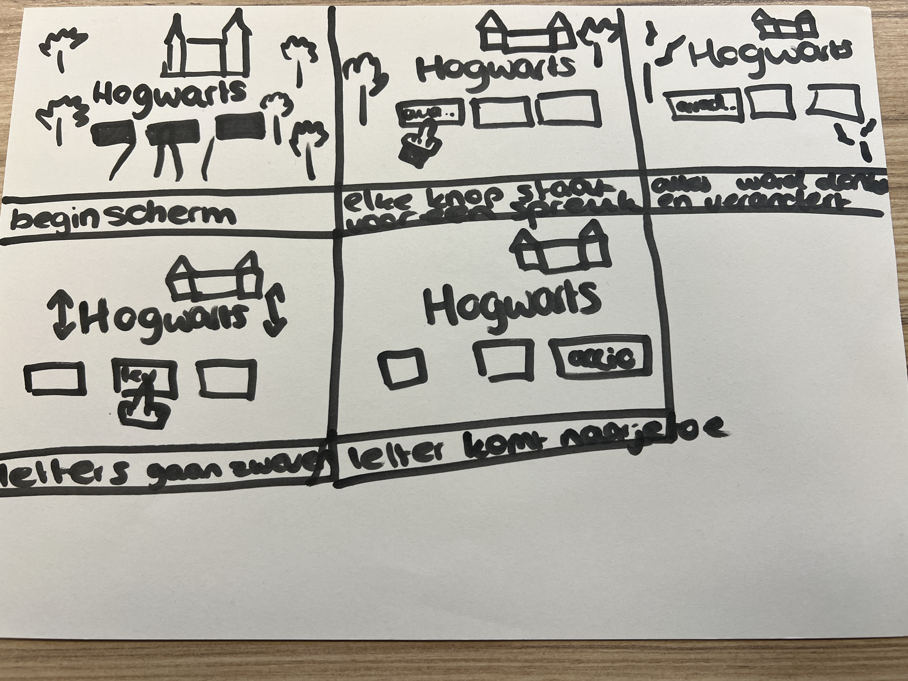

# Procesverslag
**Auteur:** - Babs Luidinga-

**De opdrachten:** [opdracht 1](opdracht1/index.html) en [opdracht 2](opdracht2/index.html)

Link naar pages: https://babsluidinga.github.io/FrontendForDesigners/

Markdown is een simpele manier om HTML te schrijven.  
Markdown cheat cheet: [Hulp bij het schrijven van Markdown](https://github.com/adam-p/markdown-here/wiki/Markdown-Cheatsheet).

Nb. De standaardstructuur en de spartaanse opmaak van de README.md zijn helemaal prima. Het gaat om de inhoud van je procesverslag. Besteedt de tijd voor pracht en praal aan je website.

Nb. Door *open* toe te voegen aan een *details* element kun je deze standaard open zetten. Fijn om dat steeds voor de relevante stuk(ken) te doen.

## Bronnenlijst
  1. https://glyphter.com
  2. https://css-tricks.com/almanac/properties/c/cursor/
  3. https://www.w3schools.com/howto/howto_js_add_class.asp
  4. https://css-tricks.com/a-complete-guide-to-custom-properties/

## Opdracht 1 plan

  
uitwerken na schetsen idee (voor week 2)

  ### Je storyboard:
  

  ### Je ambitie: 
  Aan deze technieken/punten wil ik werken:
  - Het veranderen van variabelen
  - Het natuurlijk laten lijken van een animatie, het moet 'kloppen'
  - Het maken van een eigen font
  - Een custom cursor maken
 

## Opdracht 1 reflectie

  
uitwerken bij afronden opdracht (voor week 4)

  ### Je uitkomst - karakteristiek screenshot(s):

  
  

  ### Dit ging goed/Heb ik geleerd: 
  Wat ik goed vond gaan was het natuurlijk laten lijken van de zwevende letters. Ik vind het leuk dat ik echt geprobeerd heb alles in zo min mogelijk regels CSS te schrijven, en denk ook echt dat dat wel gelukt is. Daarnaast vind ik de animatie van het lichte thema naar het donkere, met de 'whisp' die pulsed en groeit enorm tof geworden. Ik heb daarnaast geleerd hoe ik een font vanuit SVG's kan maken, duurde langer dan ik dacht om een juiste tool te vinden, maar ben echt enorm blij met het resultaat. 

  

  ### Dit was lastig/Is niet gelukt:
  Ik wilde eigenlijjk meerdere spreuken maken, en mijn handen jeuken ng steeds om dit toch nog toe te voegen. Daarnaast dat de 'whisp' meerdere bewegingen had gemaakt, voordat de transitie naar het donker gaat. Helaas moet je je soms neerleggen bij wat je gemaakt heb, en op zich vind ik dat ik toch redelijk heb bereikt worden. 

## Opdracht 2 plan

  
uitwerken na schetsen idee (voor week 5)

  ### Je ontwerp:
  

  ### Je ambitie: 
  Aan deze technieken/punten wil ik werken:
  - punt 1
  - punt 2
  - nog een punt
  - ...

## Opdracht 2 test

  
uitwerken na testen (week 7)

  Neem minimaal 5 bevindingen op:

  ### Bevinding 1:
  Omschrijving van wat er nog niet orde was (tekst en afbeeding(en)).

  #### oplossing:
  Beschrijving hoe je het hebt hebt opgelost of als het niet gelukt is hoe je het zou oplossen (tekst en afbeeding(en)).

  ### Bevinding 2:
  Omschrijving van wat er nog niet orde was (tekst en afbeeding(en)).

  #### oplossing:
  Beschrijving hoe je het hebt hebt opgelost of als het niet gelukt is hoe je het zou oplossen (tekst en afbeeding(en)).

  ### Bevinding 3:
  ...

## Opdracht 2 reflectie

  
uitwerken bij afronden opdracht (voor week 8)

  ### Je uitkomst - karakteristiek screenshot(s):
  

  ### Dit ging goed/Heb ik geleerd: 
  Korte omschrijving met plaatje(s)

  

  ### Dit was lastig/Is niet gelukt:
  Korte omschrijving met plaatje(s)

  

