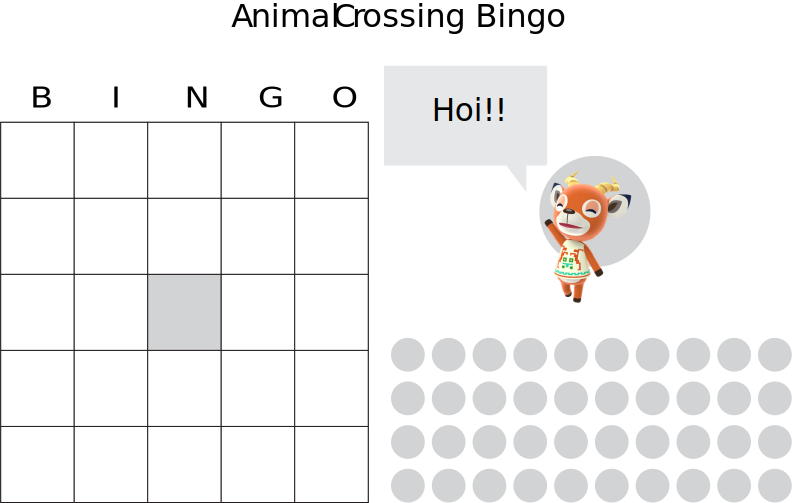
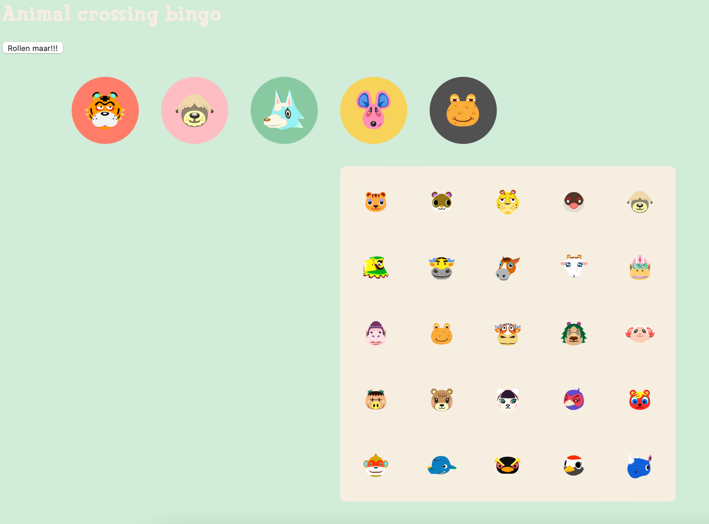
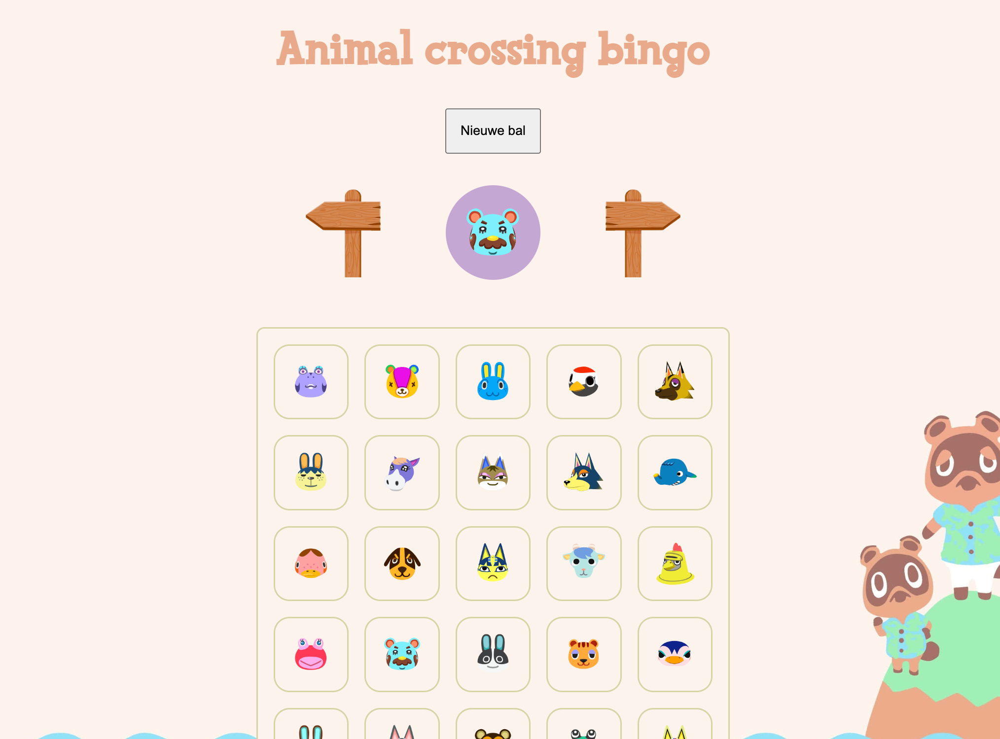
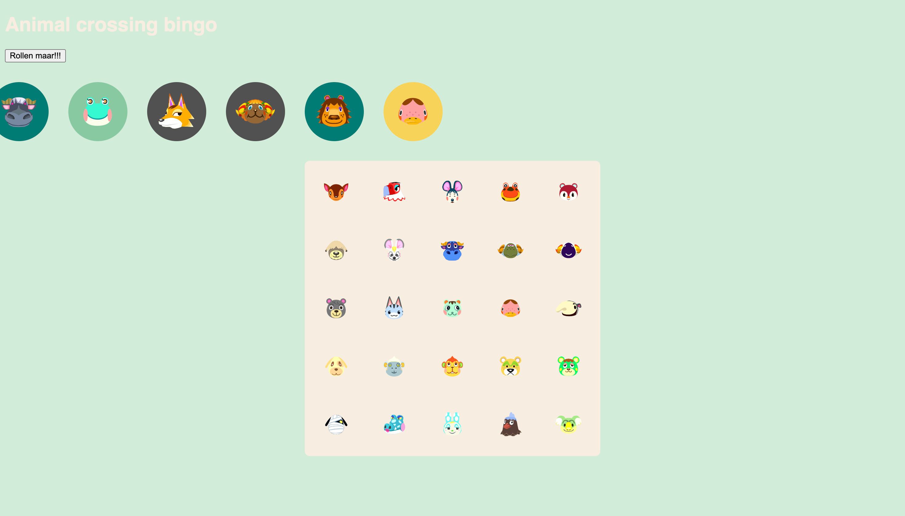
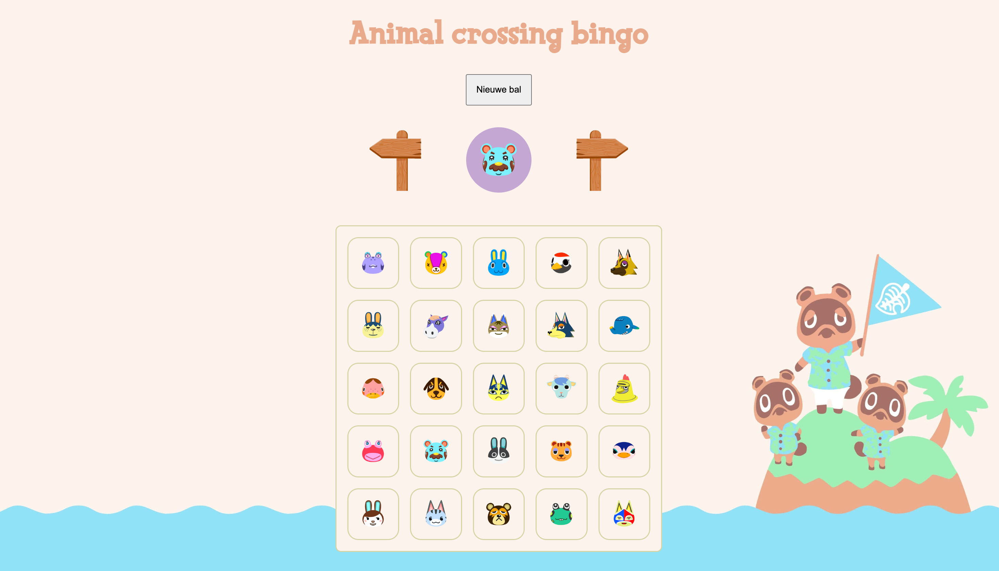
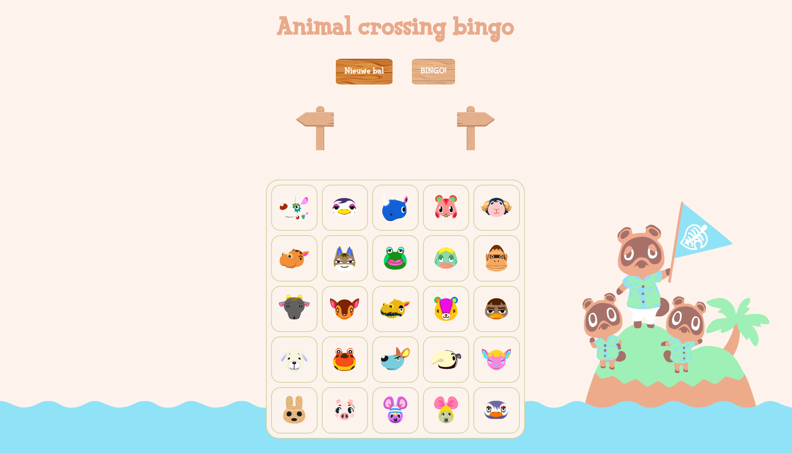
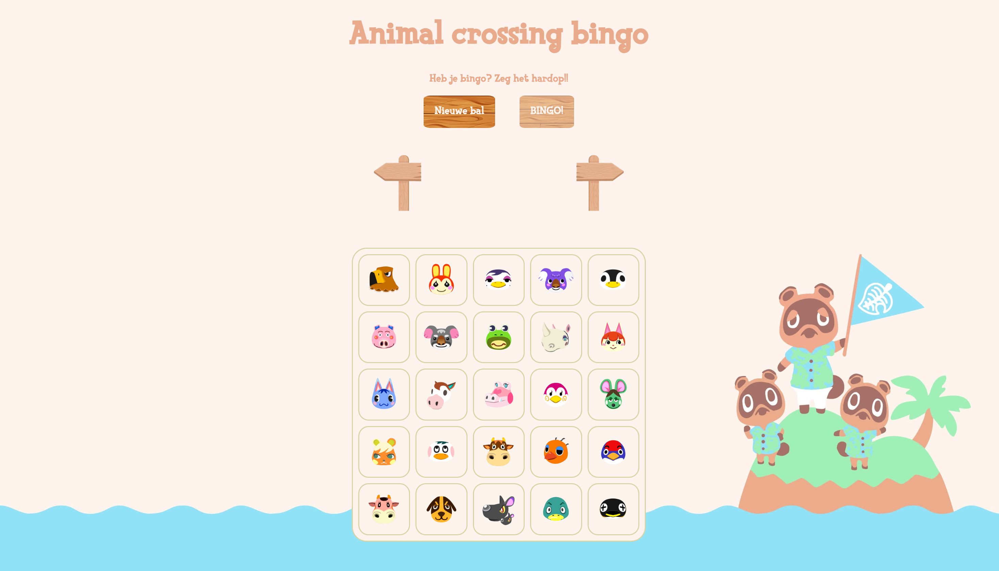
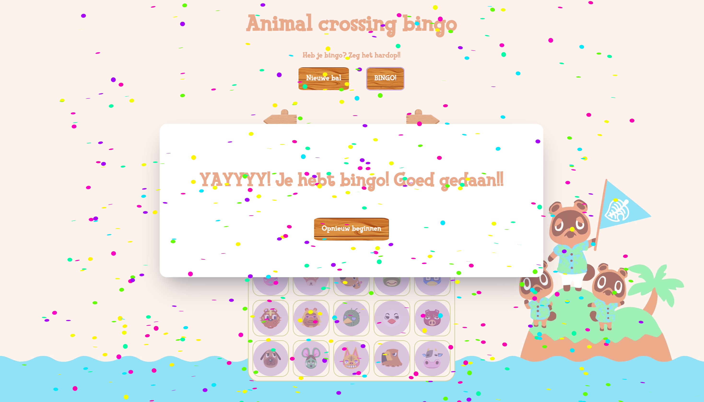

# Procesverslag
**Auteur:** - Babs Luidinga-

**De opdrachten:** [opdracht 1](opdracht1/index.html) en [opdracht 2](opdracht2/index.html)

Link naar pages: https://babsluidinga.github.io/FrontendForDesigners/

Markdown is een simpele manier om HTML te schrijven.  
Markdown cheat cheet: [Hulp bij het schrijven van Markdown](https://github.com/adam-p/markdown-here/wiki/Markdown-Cheatsheet).

Nb. De standaardstructuur en de spartaanse opmaak van de README.md zijn helemaal prima. Het gaat om de inhoud van je procesverslag. Besteedt de tijd voor pracht en praal aan je website.

Nb. Door *open* toe te voegen aan een *details* element kun je deze standaard open zetten. Fijn om dat steeds voor de relevante stuk(ken) te doen.

## Bronnenlijst
  1. https://glyphter.com
  2. https://css-tricks.com/almanac/properties/c/cursor/
  3. https://www.w3schools.com/howto/howto_js_add_class.asp
  4. https://css-tricks.com/a-complete-guide-to-custom-properties/

## Opdracht 1 plan

  
uitwerken na schetsen idee (voor week 2)

  ### Je storyboard:
  

  ### Je ambitie: 
  Aan deze technieken/punten wil ik werken:
  - Het veranderen van variabelen
  - Het natuurlijk laten lijken van een animatie, het moet 'kloppen'
  - Het maken van een eigen font
  - Een custom cursor maken
 

## Opdracht 1 reflectie

  
uitwerken bij afronden opdracht (voor week 4)

  ### Je uitkomst - karakteristiek screenshot(s):

  
  

  ### Dit ging goed/Heb ik geleerd: 
  Wat ik goed vond gaan was het natuurlijk laten lijken van de zwevende letters. Ik vind het leuk dat ik echt geprobeerd heb alles in zo min mogelijk regels CSS te schrijven, en denk ook echt dat dat wel gelukt is. Daarnaast vind ik de animatie van het lichte thema naar het donkere, met de 'whisp' die pulsed en groeit enorm tof geworden. Ik heb daarnaast geleerd hoe ik een font vanuit SVG's kan maken, duurde langer dan ik dacht om een juiste tool te vinden, maar ben echt enorm blij met het resultaat. 

  

  ### Dit was lastig/Is niet gelukt:
  Ik wilde eigenlijjk meerdere spreuken maken, en mijn handen jeuken ng steeds om dit toch nog toe te voegen. Daarnaast dat de 'whisp' meerdere bewegingen had gemaakt, voordat de transitie naar het donker gaat. Helaas moet je je soms neerleggen bij wat je gemaakt heb, en op zich vind ik dat ik toch redelijk heb bereikt worden. 

## Opdracht 2 plan

  
uitwerken na schetsen idee (voor week 5)

  ### Je ontwerp:
  

  ### Je ambitie: 
  Aan deze technieken/punten wil ik werken:
  - Het koppelen van een API
  - Javascript skills
  - Passende animaties kunnen maken
  - Voice interaction

## Opdracht 2 test

  
uitwerken na testen (week 7)

  Neem minimaal 5 bevindingen op:

  ### Bevinding 1:
  Op het moment dat je op 'nieuwe bal' klikte, ging je maar 1 plekje terug in de lijst, en niet naar de positie waar de nieuwe bal stond (afbeelding is niet echt te maken hiervan?).

  #### oplossing:
  Ik heb in de Javascript toegevoegd dat de variabele 'huidigepositie' 0 moet worden op het moment dat er op de nieuwe bal knop wordt geklikt. Hierdoor kun je nu gemakkelijk terug naar de nieuwste bal, in plaats van door alle ballen heen te navigeren.

  ### Bevinding 2:
  Door te moeten scrollen tussen de ballen werd het erg onoverzichtelijk en rommelig.

  

  #### oplossing:
  Ik heb voor knoppen met pijltjes gekozen. Op deze manier krijg je nu standaard de nieuwste bal te zien, maak kun je door middel van pijltjes ook de vorige getrokken ballen zien. Wat ik nog had willen doen is het maken van een uitklapbaar veld waar je de gehele lijst kon zien van de getrokken villagers, zodat het ook makkelijk in een overzicht te zien zou zijn. 

   

  ### Bevinding 3:
  De styling was erg chaotisch en het animal crossing gevoel kwam niet over. De tester had ook niet helemaal door dat het Animal Crossing was. 

   

  #### oplossing:
  Door een nieuwe styling aan te maken, met kleuren die ik uit het animal crossing thema heb gehaald, heb ik gezorgd voor de island vibes die animal corssing heeft, samen met het schattige van wat de gehele game als look en feel heeft.

   

  ### Bevinding 4:
  Het was onduidelijk dat het een bingokaart was, er waren niet echt vakjes aangegeven.

   

  #### oplossing:
  Door borders om de bingovakjes te doen krijg je nu al veel meer het gevoel dat je bingo aan het spelen bent.

   

  ### Bevinding 5:
  De gebruiker kon niet laten merken dat er bingo was, ook was het niet duidelijk dat je bingo kon roepen.

   

  #### oplossing:
  Ik heb de knop 'BINGO' toegevoegd, deze wordt geactiverd zodra alle vakjes aangevinkt zijn. Het enige wat ik niet heb kunnen doen door tijdsgebrek was nog een creatieve manier bedenken om te laten weten dat je bingo hebt. Vandaar dat ik onder de titel een simpele tekst heb geschreven om dit duidelijk te maken.

      

## Opdracht 2 reflectie

  
uitwerken bij afronden opdracht (voor week 8)

  ### Je uitkomst - karakteristiek screenshot(s):
  

  De uitkomst van deze tweede opdracht is een bingospel met Animal Crossing karakters. Het spel is geen twee keer hetzelfde, aangezien ik telkens 75 random karakters uit de AnimalCrossing API haal. 

  ### Dit ging goed/Heb ik geleerd: 
  Ik vind het heel leuk dat het bingo roepen gelukt is, waarnaar zich een klein feest op je scherm afspeelt. Ook de manier waarop de villagers uit de API worden gehaald vind ik super tof en creatief. De interacte op het scherm, met de draaiende ballen vind ik ook goed geslaagd. En tot slot het toevoegen van de dark mode, door middle van een background blend mode vind ik echt dat het eruit ziet alsof je het spel in de avond aan het spelen bent!

  
  
   

  ### Dit was lastig/Is niet gelukt:
  Ik had nog quotes willen toevoegen van de villagers, daarnaast vind ik het jammer dat ik het niet voor elkaar heb kunnen krijgen om mijn bingospel echt te kunnen valideren, een valse bingo is stiekem iets te gemakkelijk gemaakt voor de gebruiker. Maarja, je kunt niet alles hebben. Ik ben over het algemeen heel trots op wat ik heb neergezet in 4 weken tijd, dit is niet iets wat ik dacht te kunnen!

  

